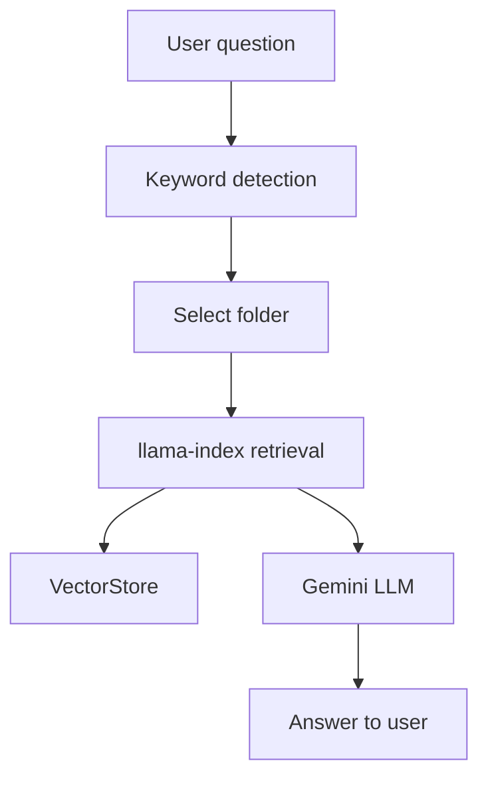
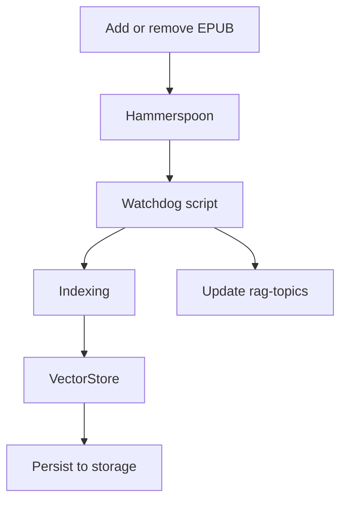

# Literature RAG

Automated system for private, fast retrieval-augmented queries over your reference books. Uses Gemini for embeddings and LLM, with all API keys kept secure in `.env`. Integrates with VS Code (Copilot MCP) for seamless querying, and supports CLI workflows. All code and data live in `~/Documents/literature`.

---

## What it does

1. **Indexes `.epub` books** in thematic folders under `books/`
2. **Extracts and updates keywords** for each folder using Gemini
3. **Allows fast queries** with citations, markdown links, and text snippets
4. **Integrates with VS Code (Copilot MCP)** for direct queries in the editor
5. **Keeps API keys secure** in `.env` (never exposed in config)
6. **Tracks costs** for queries and embeddings

---

## Requirements

- **VS Code** (for editing and MCP integration)
- **Python 3.11+** (recommended)
- **llama-index** (RAG framework)
- **ebooklib** (EPUB parsing)
- **beautifulsoup4** (HTML parsing)
- **google-generativeai** (Gemini API)
- **watchdog** (file monitoring)
- **Hammerspoon** (macOS, for auto-indexing)
- **Gemini API key** (kept in `.env`)

---

## Installation

```bash
git clone https://github.com/youruser/literature.git
cd literature
python3 -m venv .venv
source .venv/bin/activate
pip install -r requirements.txt
# Copy .env.example to .env and add your GOOGLE_API_KEY
```

Install [Hammerspoon](https://www.hammerspoon.org/) and configure the `literature_rag.lua` script to watch the `books/` folder for changes. All code and data live in `~/Documents/literature`.

---

## Usage

### Adding or removing books

1. Place `.epub` files in a folder under `books/` (e.g., `books/urbanism/`)
2. Hammerspoon (macOS) detects changes and triggers auto-indexing
3. Keywords for each folder are updated automatically using Gemini
4. `.rag-topics` files are created/updated for keyword management

### CLI

- Query a book:
  ```bash
  python3 scripts/query_book.py "Book Name" "Your question"
  ```
- View costs/usage:
  ```bash
  python3 scripts/view_detailed_costs.py
  ```

### VS Code (MCP)

- Ask questions directly in Copilot (MCP panel):
  - `What is legibility?`
  - `Show me usage for anthropocene`
  - Results include citations, markdown links, and cost tracking

---

## Architecture

### 1. Querying (Ask a Question)



### 2. Updating RAG (Add/Remove Book)



---

## Security & Best Practices

- All API keys are kept in `.env` and never exposed in config files or code.
- Only the Gemini API key is required for embedding and LLM.
- All code and data live in `~/Documents/literature` for privacy and portability.

---

## TODO

- [x] ~~Implement `test_gemini_rag.py` with EpubReader~~
- [x] ~~Test indexing: 2 EPUBs (Seeing Like a State, How Forests Think)~~
- [x] ~~Persist in JSON (docstore.json + default\_\_vector_store.json)~~
- [x] ~~Persist in JSON (docstore.json + default\_\_vector_store.json)~~

### ✅ Phase 2: Queries & CLI

- [x] ~~CLI query_book.py with book name + question~~
- [x] ~~Answers with source citations (snippets + relevance scores)~~
- [x] ~~Test: "What is legibility?", "How do societies evade legibility?"~~
- [x] ~~Validate retrieval working, "How do societies evade legibility?"~~
- [x] ~~Validate retrieval working~~

### ✅ Phase 3: Organização Temática com Keywords

- [x] ~~Folder structure: `urbanism/`, `anthropocene/`~~
- [x] ~~Format `.rag-topics` (robots.txt style)~~
- [x] ~~Manual keywords: `legibility, state, urban planning...`~~
- [x] ~~Auto-detection: question → match keywords → search in the correct folder~~
- [x] ~~Automatic keywords: Gemini LLM extracts when indexing the correct folder~~
- [x] ~~Automatic keywords: Gemini LLM extracts when indexing~~

### ✅ Phase 4: Auto-Indexing Completo

- [x] ~~`literature_watchdog.py`: monitors files + extracts keywords + updates `.rag-topics`~~
- [x] ~~`literature_rag.lua`: Hammerspoon with macOS notifications + updates `.rag-topics`~~
- [x] ~~Test: add EPUB → auto-index with keywords~~
- [x] ~~Test: remove EPUB → clean from index with keywords~~
- [x] ~~Validate: keywords appear in `.rag-topics` automatically~~
- [x] ~~Tools: query_literature, list_books, get_literature_costs~~
- [ ] **Test: reload VS Code + ask directly in Copilot**
- [ ] **Validate: sources with markdown links working**

### ⏳ Phase 6: VS Code Copilot Integration (MCP)

- [x] ~~MCP server implemented (literature_mcp_server.py)~~
- [x] ~~Configured in `~/Library/.../mcp.json`~~
- [x] ~~Tools: query_literature, list_books, get_literature_costs~~
- [ ] **Test: reload VS Code + ask directly in Copilot**
- [ ] **Validate: sources with markdown links working**

### 🔮 Next steps

- [ ] PDF support (besides EPUB)
- [ ] EPUB metadata (author, year) in answers
- [ ] Automatic cross-book queries (search in multiple folders)
- [ ] OpenAI fallback if Gemini fails
- [x] ~~Prompt `literature_use.prompt.md` to facilitate queries~~

```

```
