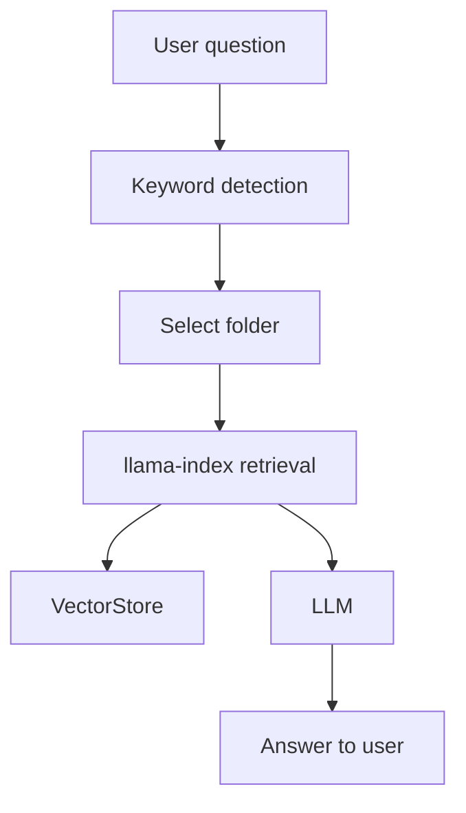
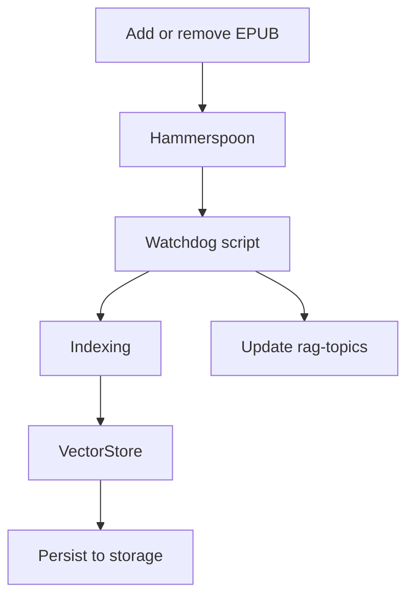

# Literature RAG

A system that automatically ingests `.epub` books into a local RAG (Retrieval-Augmented Generation) for fast, private consultation via CLI or VS Code (MCP integration).

---

## What it is

- Indexes `.epub` books in thematic folders
- Extracts and updates keywords automatically
- Allows fast queries with citations and text snippets
- Integrates with VS Code (Copilot MCP) and CLI

---

## Requirements

- [VS Code](https://code.visualstudio.com/) (for editing and MCP integration)
- [Hammerspoon](https://www.hammerspoon.org/) (macOS, for auto-indexing)
- [Python 3.9+](https://www.python.org/)
- [llama-index](https://github.com/jerryjliu/llama_index) (RAG framework)
- [ebooklib](https://github.com/aerkalov/ebooklib) (EPUB parsing)
- [beautifulsoup4](https://www.crummy.com/software/BeautifulSoup/) (HTML parsing)
- [google-generativeai](https://github.com/google/generative-ai-python) (Gemini API)
- [watchdog](https://github.com/gorakhargosh/watchdog) (file monitoring)
- an LLM
- Embedding Model API Key (we use Gemini)

---

## Installation

```bash
git clone https://github.com/youruser/literature.git
cd literature
python3 -m venv .venv
source .venv/bin/activate
pip install -r requirements.txt
# Copy .env.example to .env and add your GOOGLE_API_KEY
```

Install [Hammerspoon](https://www.hammerspoon.org/) and configure the `literature_rag.lua` script to watch the `books/` folder for changes.

---

## Usage

### Adding or removing books

- Ensure that book is `.epub` format
- Add it on `/books/` under an existing folder topic, or create a new one
- Hammerspoon will detect changes and:
  - Index book automatically
  - Create or edit .rag-topics with updated keywords

### CLI

- Query a book:
  ```bash
  python3 scripts/query_book.py "Book Name" "Your question"
  ```
- View costs/usage:
  ```bash
  python3 scripts/view_detailed_costs.py
  ```

### VS Code (MCP)

- Ask in Copilot:
  `What is legibility?`
  `Show me usage for anthropocene`

---

## Architecture

### 1. Querying (Ask a Question)



### 2. Updating RAG (Add/Remove Book)



---

## TODO

[x] Implement `test_gemini_rag.py` with EpubReader
[x] Test indexing: 2 EPUBs (Seeing Like a State, How Forests Think)
[x] Persist in JSON (docstore.json + default\_\_vector_store.json)
[x] Persist in JSON (docstore.json + default\_\_vector_store.json)

### ✅ Phase 2: Queries & CLI

[x] CLI query_book.py with book name + question
[x] Answers with source citations (snippets + relevance scores)
[x] Test: "What is legibility?", "How do societies evade legibility?"
[x] Validate retrieval working, "How do societies evade legibility?"
[x] Validate retrieval working

### ✅ Phase 3: Organização Temática com Keywords

[x] Folder structure: `urbanism/`, `anthropocene/`
[x] Format `.rag-topics` (robots.txt style)
[x] Manual keywords: `legibility, state, urban planning...`
[x] Auto-detection: question → match keywords → search in the correct folder
[x] Automatic keywords: Gemini LLM extracts when indexing the correct folder
[x] Automatic keywords: Gemini LLM extracts when indexing

### ✅ Phase 4: Auto-Indexing Completo

[x] `literature_watchdog.py`: monitors files + extracts keywords + updates `.rag-topics`
[x] `literature_rag.lua`: Hammerspoon with macOS notifications + updates `.rag-topics`
[x] Test: add EPUB → auto-index with keywords
[x] Test: remove EPUB → clean from index with keywords
[x] Validate: keywords appear in `.rag-topics` automatically
[x] Tools: query_literature, list_books, get_literature_costs
[ ] **Test: reload VS Code + ask directly in Copilot**
[ ] **Validate: sources with markdown links working**

### ⏳ Phase 6: VS Code Copilot Integration (MCP)

[x] MCP server implemented (literature_mcp_server.py)
[x] Configured in `~/Library/.../mcp.json`
[x] Tools: query_literature, list_books, get_literature_costs
[ ] **Test: reload VS Code + ask directly in Copilot**
[ ] **Validate: sources with markdown links working**

### 🔮 Next steps

[ ] PDF support (besides EPUB)
[ ] EPUB metadata (author, year) in answers
[ ] Automatic cross-book queries (search in multiple folders)
[ ] OpenAI fallback if Gemini fails
[x] Prompt `literature_use.prompt.md` to facilitate queries

```

```
